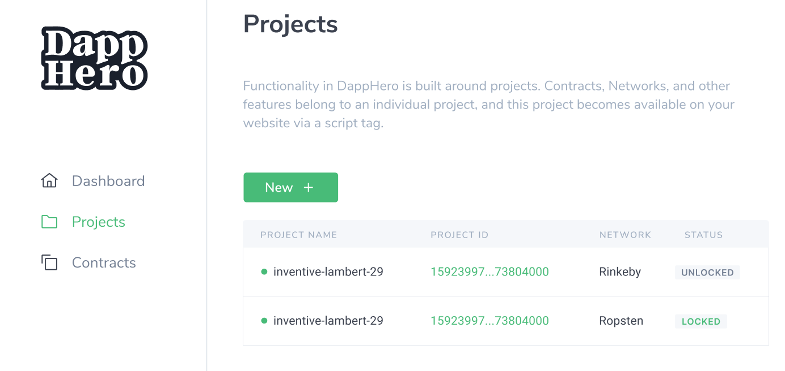
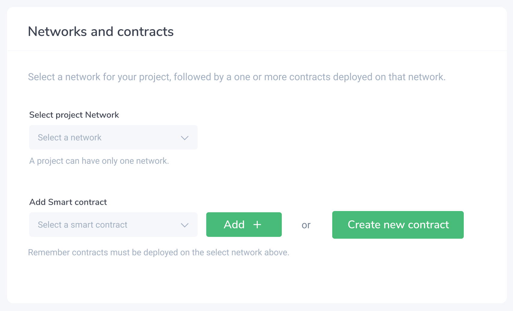
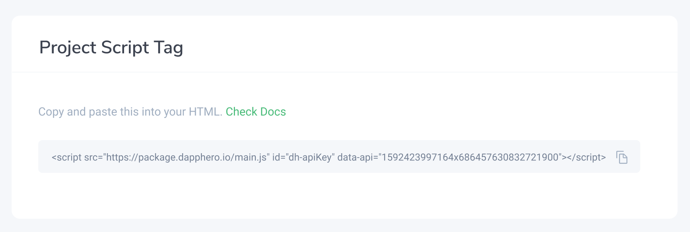
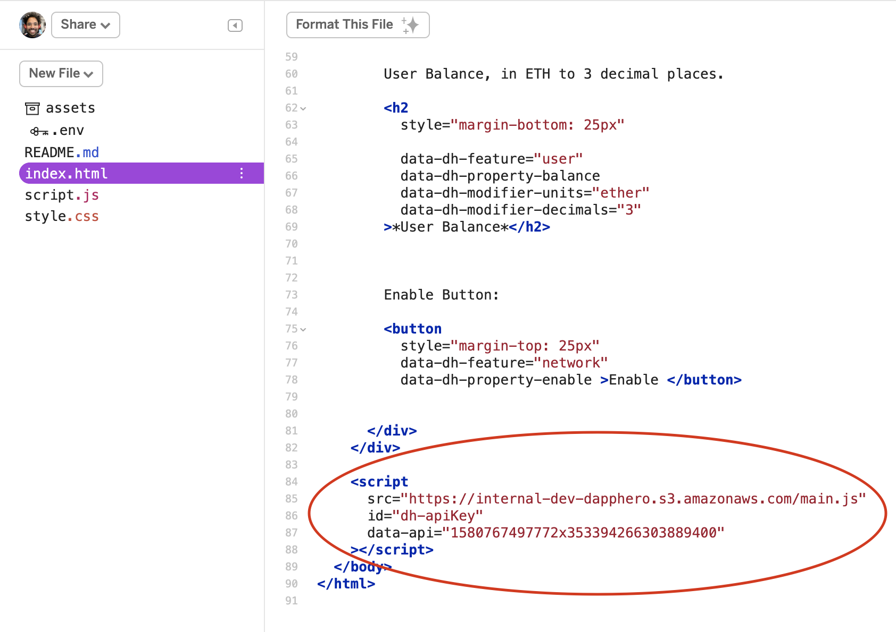
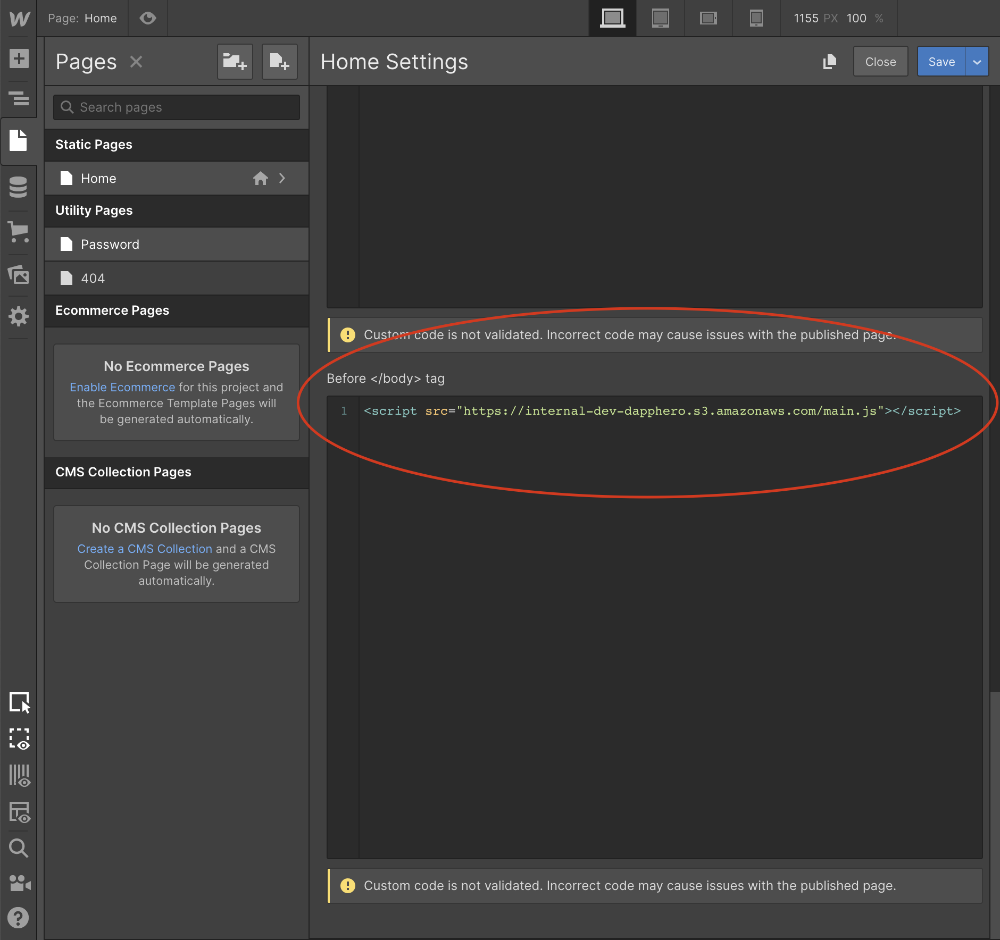

# Setting Up Your Project 🏗️

Getting started with DappHero is easy!

1. Signup, login, and create a new project. 
2. Copy your custom script tag and embed it in your website, right before the closing `</body>` tag. 
3. Tag your elements and check out the awesomeness!

### 1. Signup

### 2. Create a new project

### 3. Create or Add smart contracts \(optional\) 

### 4. Copy your custom script tag

### 5. Embed the script tag in your webpage: \(Raw HTML Version\) 

### 5. Embed the script tag in your webpage: \(WebFlow Version\) 


When starting with WebFlow from scratch, you will need at least a [Lite Account](https://webflow.com/pricing#site) to add custom script tags. You can always start by cloning our Custom Templates which already have the script tag embedded. 



Like Webflow? Love No-Code? Head over to [Getting Started with Webflow](../../integrations/using-weblow/starting-with-webflow.md)


Here is a [bare-bones HTML](https://glitch.com/~dapphero-intro) version of how to add your script tag so you can understand where it needs to be. Regardless of your no-code tool or website builder, the script tag location should be more or less the same. A quick primer on [adding script tags](https://www.wikihow.com/Add-JavaScript-to-Your-Website-Using-HTML).

