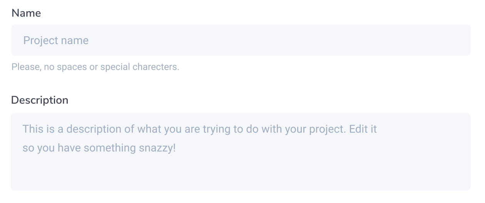
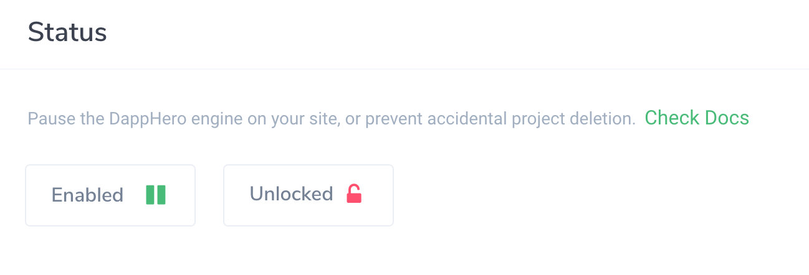

# Projects

Projects are the core organizational tool in DappHero. Loosely they represent one 'website' where the DappHero engine should coordinate providing blockchain services. A single webpage can have only one DappHero project per page. 

Currently, in a project, you add smart contracts, which are then accessible on the website where DappHero is loaded. 

#### Project Script Tag

The project script tag is found at the top of the Project page. This tag is what needs to be added to your HTML to enable DappHero to run inside the browser. 

#### Name

This is the name of your project. It should be unique, without any special characters or spaces, and not include private information.

#### Description

‌The description is used internally for your own organization. It is useful to provide notes or details here that might be needed in the future.

#### Cover Image

The cover image will be automatically displayed if you use the auto-generated HTML functionality. 

#### Networks

Currently, projects can support only a single Ethereum based blockchain per project. This network needs to match your smart contracts network. Select your network first, and click "Add" to add it to your project. 

After you select a network the "Add Smart contract" drop-down will be populated with your smart contracts deployed on your selected project network.  Once you have selected a network and added a smart contract you will not be able to select a new network until you have deleted all your smart contracts.  

#### Contracts

Once you've added a network, your list of smart contracts that you have previously created on the contracts page will populate based on your selected network. It is only possible to add a contract that is deployed on your selected network.

If you choose to "Create new contract" a new contract will be created and added to your project, however, you will need to edit it from the Contracts tab on the menu bar to the left. 

#### **Pause/Enabled**

In some cases, you may wish to pause the DappHero engine while working on your site. 

#### Protect‌

When enabled, your project can not be changed or deleted. This is helpful to prevent accidentally changing features. 

