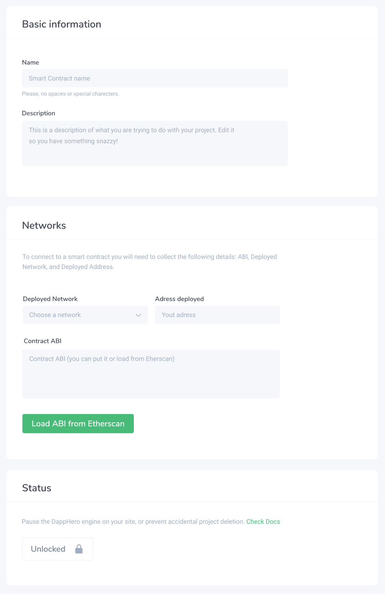

# Smart Contracts

Smart contracts are the primary way of interacting with the Ethereum blockchain. DappHero does not currently create or deploy smart contracts, so you will need to have already a smart contract deployed to a network to connect.

#### Name

Each smart contract needs a name inside DappHero. The name does not have to be the "official" name of the smart contract as deployed on the blockchain. DappHero will use to refer to the configuration settings regarding your contract, and it is essential to remember precisely. Pick something without spaces or special characters. This information should not be secret. 

#### Description

Here you can leave notes about the smart contract. It is useful if you need to refer to your project in the future and want to organize some information regarding your settings. 

#### Network 

The Network settings are where you _describe_ your contract. Here you will need to provide three things:

* Network - this can be Mainnet Ethereum or any of the public testnets. Private networks are currently not supported.
* Deployed Address - this is the actual _ethereum address_ at which the contract you wish to connect is deployed.
* Contract ABI - this is a JSON object which describes the smart contract and smart contract methods you are trying to connect in DappHero. 

#### Load ABI from Etherscan 

For smart contracts that have been **verified** on the block explorer [Etherscan.io](https://www.etherscan.io/) it is now possible to automatically load their ABI. This feature is supported by Mainnet, Rinkeby, Ropsten, Kovan, and Goerli. It will not work on other networks. 

To have your contract verified, you can [use this tool](https://etherscan.io/verifyContract) a helpful article to [learn more](https://medium.com/coinmonks/how-to-verify-and-publish-on-etherscan-52cf25312945) about verifying smart contracts. 

#### Protect

When green and locked, your contract settings can not be accidentally changed. 

