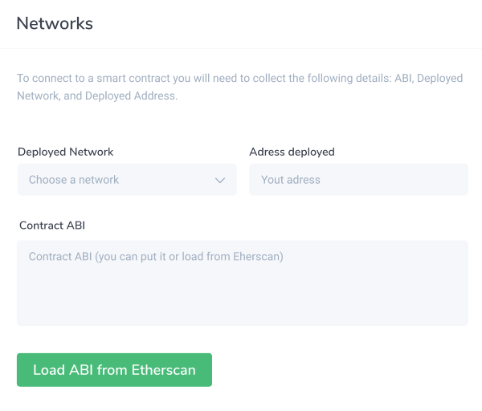

# Adding Smart Contracts 🏗️

### Add a Smart Contract

Once you've created a project in your DappHero admin, you can add a smart contract by clicking on the "Contract" button on the lefthand menu. 

### Adding your Contract

To add a new contract, you will need to know a few things first: 


Learn more about getting your [Contract Detail](contract-details.md)


1. **Address** - \(The location on the blockchain where the contract lives\)
2. **Network** - \(The specific blockchain network where the contract live\)
3. **ABI** - \(This is a special code object, called JSON, which tells DappHero how the contract works\)

The Contract Name is also required, but this value can be anything you like. 

