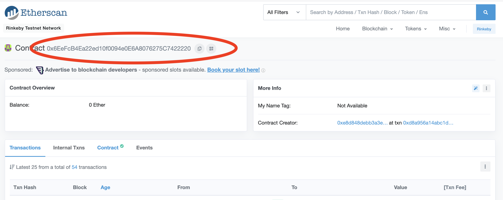
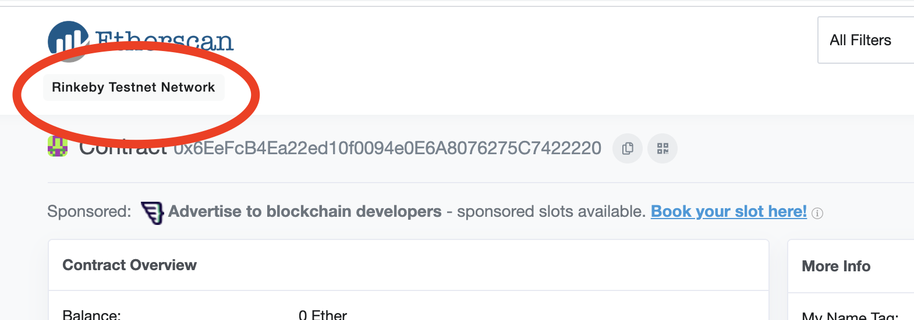
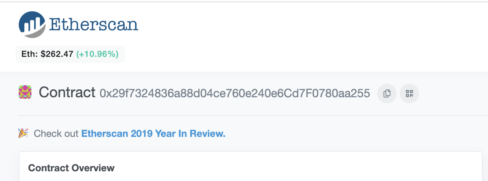
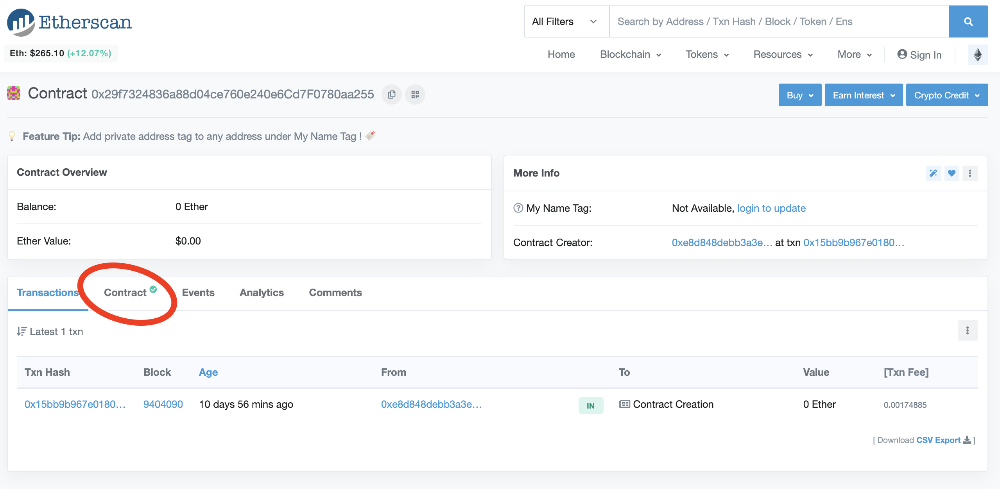
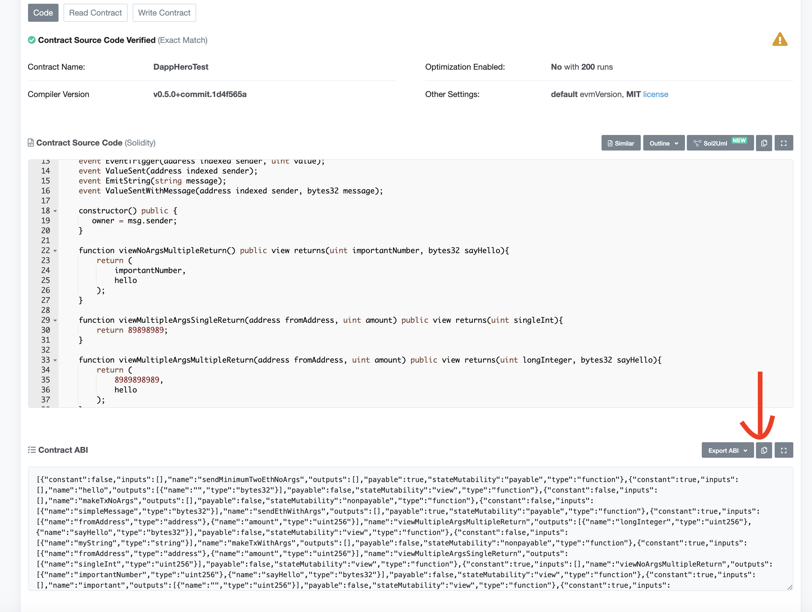

# Contract Details

### Getting your contract Details

To connect to smart contract, you need to have some information available: the address, network and abi. 


Note: Currently DappHero works with public networks and test networks. We are working on adding local development network support, coming soon!


### Address

Every contract deployed on the blockchain has it's own unique address. This address is what ensures when we connect to a contract, we are connecting to only the contract we want. It's very important to have the right address!

If you are creating your own smart contract, then you will receive this address at the end of your deployment process. 

If you are connecting to an existing smart contract, you will need to obtain this address. A popular tool to explore the Ethereum blockchain is [Etherscan](https://etherscan.io/) and here you can find lots of information, including contract information. When you find a contract you want to connect to, you can get it's address here: 

### Network

Contracts are deployed not just to unique addresses, but also to unique _networks_. When choosing a contract you will also have to specify the network where it lives. While there are a wide range of different networks where your contract can be deployed, DappHero currently supports a limited subset of popular Test networks, and Ethereum Mainnet. 

When using Etherscan you can see the network you are connect to here: 

If there is no mention of a "testnet", this means you are looking at the Ethereum Mainnet.

### ABI

Finally, you will need your contracts ABI. While all three pieces of information are required : Address, Network and ABI, the **ABI** is arguably the most important, because it tells DappHero how the contract works and what **methods** are available to use. 


It is very important you have the CORRECT ABI for your contract. DappHero can not check your ABI to be sure it's correct as the engine has no way of knowing what should be expected. For this reason it is very important to be sure you enter the correct ABI for your contract.


How ABI's work is an advanced topic that we won't cover here, but if you are creating your smart contract yourself then you will find the ABI generated after compiling your smart contract code. Be sure to copy only the ABI object from your generated contract artifacts, not the entire contract artifact which contains far more information that DappHero needs. 

#### Getting the ABI from EtherScan

Alternatively, you can get the ABI for popular, _verified,_ smart contracts directly from EtherScan. 

When you visit a contract on Etherscan, you should click the "contract" button. If it is verified, and thus has a publicly available ABI, it should have a small green checkmark. If there is no green check mark, you will not be able to get the ABI from the contract on Etherscan. 

Once you click on "contract" scroll down to "ABI", there is a small button which will allow you to copy only the ABI, which is exactly what DappHero needs. Past that into your "New Contract" in DappHero

