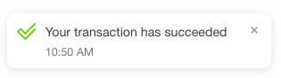

# Outputs

There are essentially two kinds of public Ethereum smart contract methods which are accessible to users outside of the blockchain: view methods, and transactions \(optionally payable transactions\). 

#### **View Methods**

View methods allow us to read data from the blockchain without needing to make a transaction or pay ETH. They are free to invoke and are useful for getting information about the current state of a smart contract. 

To receive and display data from View Methods we need only to add two attributes to a div \(or other element\). When DappHero receives this information from the smart contract \(either when the page loads because of an `auto-invoke` or when a user clicks an `invoke` button\) it will replace the content inside of the tagged element with the returned data. 

#### Outputs 

To receive the output of a view method, use the following code. This will return all the outputs returned by a view method as is useful for methods that return a single piece of data. 

For methods that return multiple pieces of data, you might want to consider [Named Outputs](outputs.md#named-outputs) as otherwise, you will not have control over each piece of returned data. 

```markup
<div 
    data-dh-property-method-id="000" 
    data-dh-property-outputs="true">
*-Placeholder for returned data-*
</div>
```

#### Named Outputs

Some view methods can return multiple pieces of information. To access those individually, it is necessary to refer to each output by their output variable name as specified on the contract ABI. 

```markup
<div 
    data-dh-property-method-id="000"
    data-dh-property-output-name="theNameOfTheOutput">
*-Placeholder for returned data-*
</div>
```


Note, you can not mix `data-dh-property-outputs="true"` with `data-dh-property-output-name="theNameOfTheOutput"` in the same element. You must pick one or the other.



**Experimental**: 

Sometimes view methods return multiple values without giving them output names. To access them, you can reference them by their position in the output data array.

Example: `data-dh-property-output-name="0"`  

Support will be expanded for accessing outputs \(and inputs\) by array position in a coming release.


### Units

DappHero also allows for conversation of units for output data. The `contract-units` always refers to the units that the smart contract is returning, while the `display-units` is the format that you wish you display the data to your users. 

```markup
<div 
    data-dh-property-method-id="000" 
    data-dh-property-outputs="true"
    data-dh-modifier-contract-units="bytes32" 
    data-dh-modifier-display-units="ascii" >
*-Placeholder for returned data-*
</div>
```

### Decimals

Currently DappHero allows for conversion of numerical unites between `wei` and `ether`. You can change the decimal places of precision using the `data-dh-modifier-decimals` tag. Support for custom units is coming soon. 

### View Method Reference

| Tag | Value | Required |
| :--- | :--- | :--- |
| `data-dh-property-method-id` | "&lt;&lt;id&gt;&gt;" | Required |
| `data-dh-property-outputs` | none | Required |
| `data-dh-property-output-name` | `<<outputName>>` |  |
| `data-dh-modifier-display-units` | `wei` `ether` `bytes32` `string` | Optional |
| `data-dh-modifier-contract-units` | `wei` `ether` `bytes32` `string` | Optional |
| `data-dh-modifier-decimal-units` | Integer | Optional |

## **Transactions**

Transactions are different than view methods and we access them in a similar way to view methods, but instead of trying to read some information from a smart contract, we are trying to _change_ some information on the blockchain. 

Unlike view methods, transactions only ever return a [transaction receipt](https://medium.com/@kctheservant/transactions-in-ethereum-e85a73068f74). This means we can not get data back from the blockchain, even if the ABI seems to indicate there is a return value. For transactions, return values are accessible only to other smart contracts inside the blockchain.

To learn how to send ETH when making a transaction read our advanced topics, [Sending ETH to a Contract](sending-eth-to-a-contract.md).

#### Return Value

Sending transactions works exactly the same as when interacting with View Methods. The only difference is that the returned value from the method transaction will be the hash of the transaction. To access this value, you can use 

```markup
<div 
    data-dh-property-method-id="000" 
    data-dh-property-outputs="true">
*-Returned Transaction Hash-*
</div>
```

### Transaction Reference

| Tag | Value | Required |
| :--- | :--- | :--- |
| `data-dh-property-method-id` | `<<id>>` | Required |
| `data-dh-property-outputs` | True | Required |

For transactions, we will only ever receive the _transaction receipt_ which is a long random number and letter hash string. Some users however may like to be able to see their transaction receipt, as users can copy and past the receipt into tools like [Etherscan](http://etherscan.com/) to check and follow the status fo their transactions. 

#### Notifications

Additionally as a convenience, DappHero injects a notification toaster system in your website that gives convenient information to the users on the status of their transaction. As soon as a transaction is started, this pop-up will appear and will inform users on the success or failure of a transaction. 




