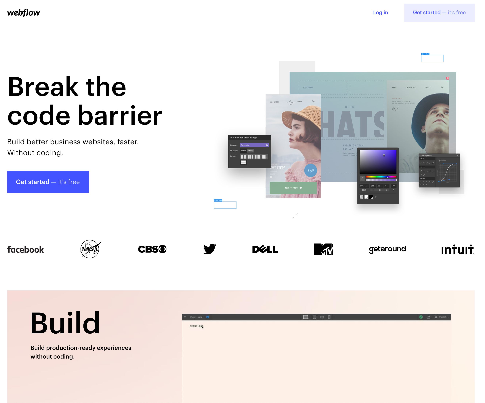

# Webflow 🎁

Webflow is a powerful, no-code, website builder used by a large number of people and powers countless websites. It caters towards users looking to build exciting, design focused web experiences. 

Getting started with Webflow is free, however to really experience the power and flexibility, or publish a public project to production, you will need to signup to a subscription. 

DappHero integrates with WebFlow for our users who prefer to use an entirely no-code solution. 

