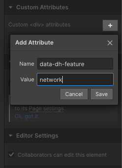

# Add DappHero Elements

Creating new DappHero Elements in WebFlow is a straightforward task. Using the Custom Attributes panel, any element you create in WebFlow can be labeled with tags to enable DappHero functionality.

### Adding DappHero Custom Attribute

To turn an ordinary element into a DappHero Element, you need only to give it a custom attribute to tell it how you want it to work. To add the Network Feature to an element  



### 

This will put the custom attribute "data-dh-feature" on your &lt;div&gt; element with the value `network`. When WebFlow eventually generates HTML, the output HTML will look something like this: 

```markup
<div data-dh-feature="network">...</div>
```

This tells the DappHero engine that this element is meant to connect to the Network Feature, and it will inject the data from **network** into the Div when your user visits your website. 

## Learn more about Custom Attributes at Webflow:

To learn more, we highly recommend you watch this short video from WebFlow about how to add custom elements: 





