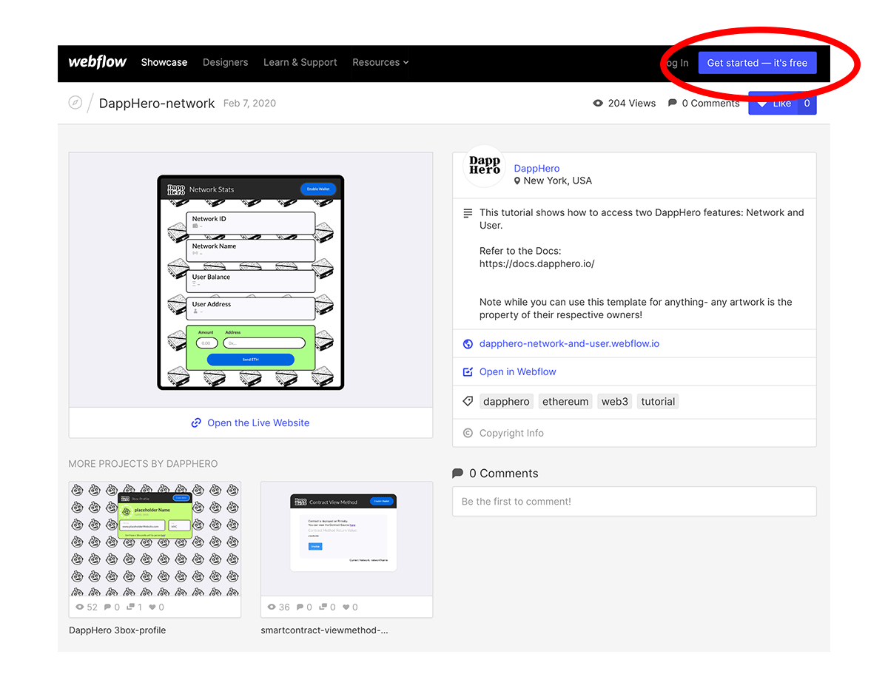
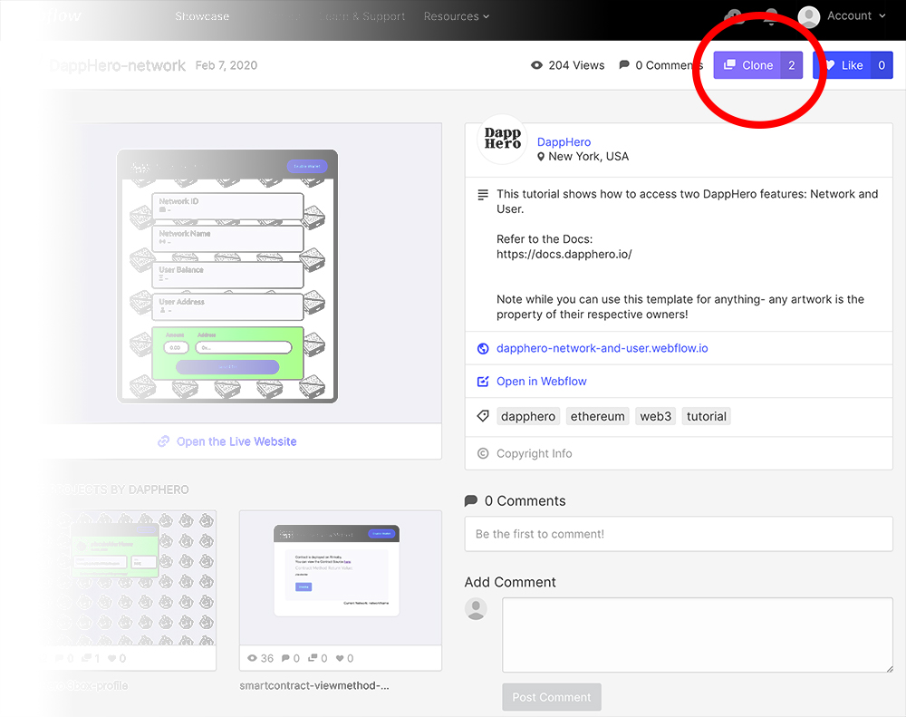
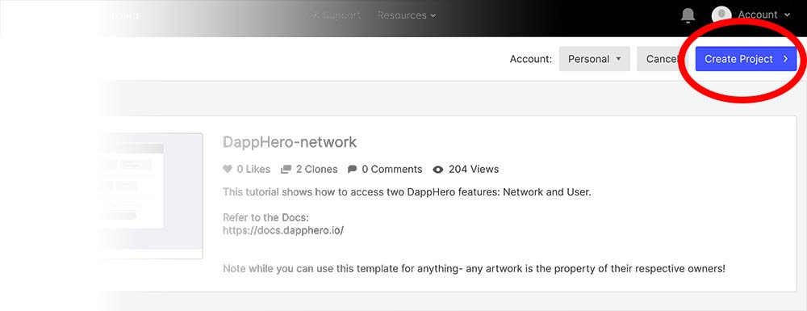
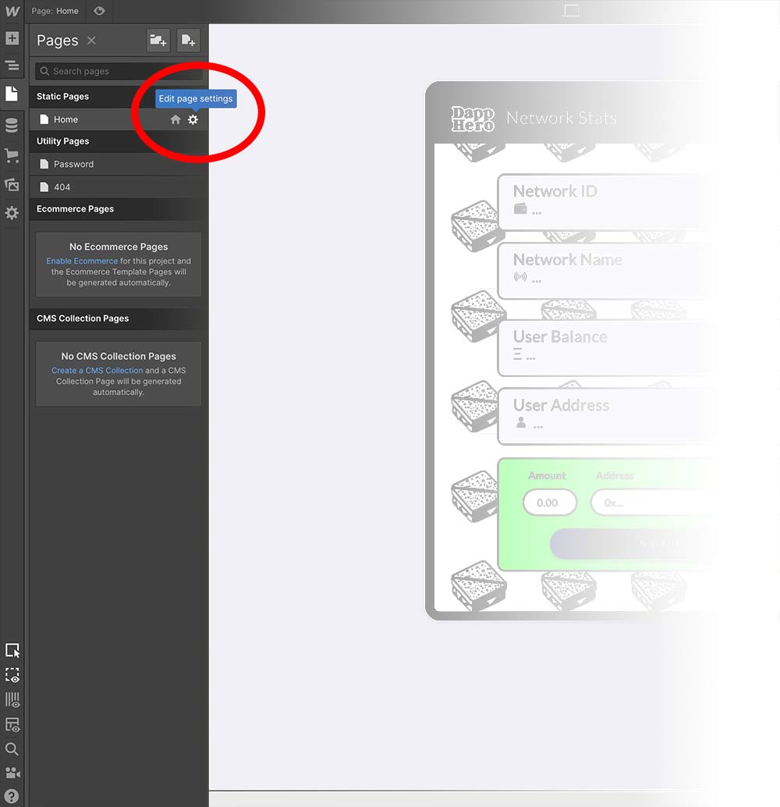
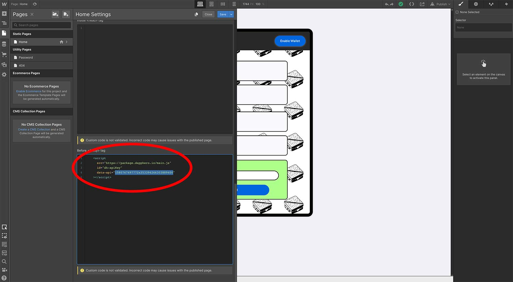

# Getting Started with Webflow

DappHero is fully equipped to work with [Webflow](https://webflow.com/), a popular drag-and-drop no-code tool for building websites. After adding a Script tag to your Webflow project, you can access all the power of DappHero by adding tags to your elements directly in the Webflow interface. 

To get started on Webflow:

* Signup to Webflow and [create an account](https://webflow.com/discover/popular#)
* \(Quick Start\) Clone a pre-made template from the [DappHero team page](https://webflow.com/team/DappHero) and change the script tag
* \(Clean Start\) Create a new project and add a script tag \(requires a paid Webflow plan\) 
* Start building your site, using DappHero tags

### Signup To Webflow

### Clone a template

Once you are signed into Webflow, you can revisit the [DappHero team page](https://webflow.com/team/DappHero) and choose a template to start with. Click "clone" to create a copy of the template to your account. 

### Create your Project

After you the template to your account, you can click "Create" to start editing. 

### Change the Script tag

Each template comes with a script tag already added. If you have added custom smart contracts to your project, you will want to change the script tag for the one in your DappHero Project. 

#### Edit your page settings


Note: the DappHero script tag needs to be added to each page you wish to enable DappHero.


#### Copy the script tag from your project

#### Paste or Edit your Script Tag

